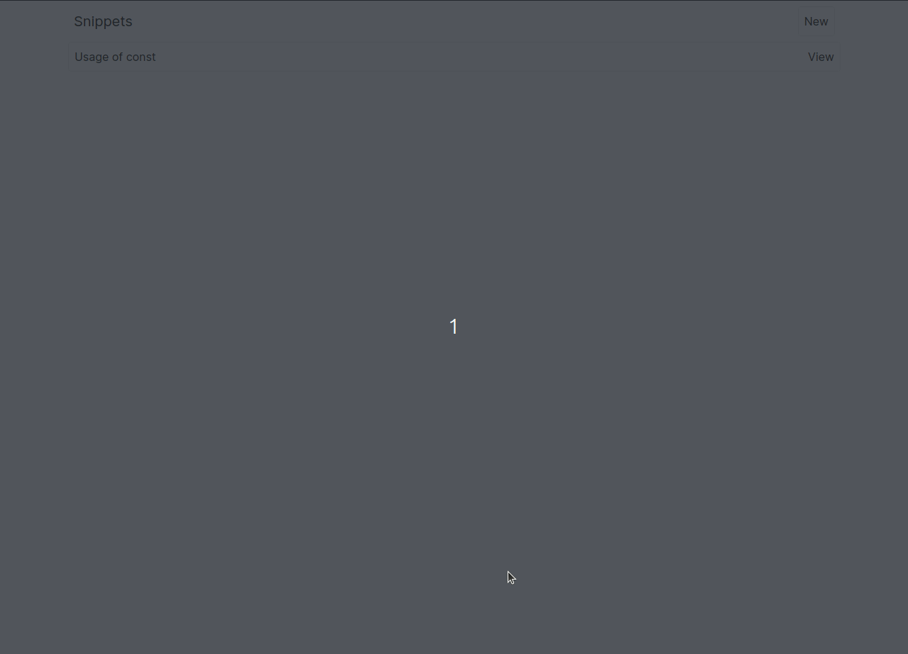

# snippy

Save your reusable code snippets!

> This project is part of [NextJS: The Complete Developer's Guide](https://www.udemy.com/course/next-js-the-complete-developers-guide/) course to learn new features such as App routers, client/server components, server actions etc.



## Getting Started

First, install all dependencies:

```bash
npm install
```

Next, create a config file:

```bash
cp .env.example .env
```

Then, run the development server:

```bash
npm run dev
```

Open [http://localhost:3000](http://localhost:3000) with your browser to see the result.
